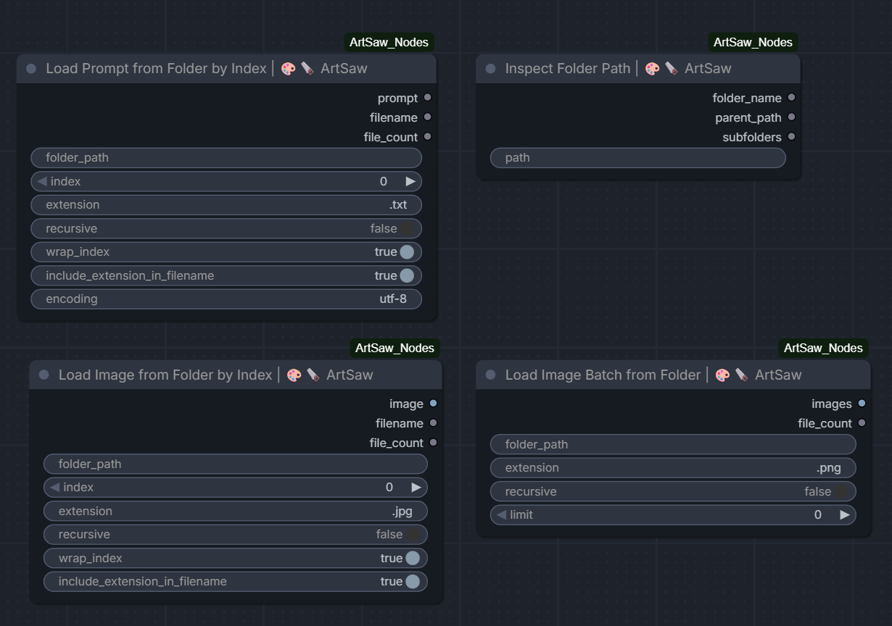

# 🎨🪚 ArtSaw Essential Tools for ComfyUI

**The easiest way to batch your ComfyUI queue with folders, prompts, and images.**

ArtSaw Essential Tools removes repetitive manual file selection from your workflows. Point a node at a folder, choose an index, and pull the matching prompt or image directly into ComfyUI.

Built for dataset workflows, image sequences, prompt libraries, and repeatable batch queues.

## Install

```text
ComfyUI/custom_nodes/ComfyUI-ArtSaw-Essential-Tools
```

Restart ComfyUI after installation.

## Nodes At A Glance



The pack provides folder navigation, indexed prompt and image loading, and sorted batch-image loading for repeatable queue workflows.

## Example Workflow

Download or drag the included workflow into ComfyUI:

[Download the ArtSaw Essential Tools workflow](workflows/ArtSaw_Essential_nodes_default.json)

The example contains all four Essential Tools nodes and shows how they fit into a folder-driven workflow.

## Included Nodes

### Load Prompt from Folder by Index | 🎨🪚 ArtSaw

Loads a text prompt from a folder by its sorted index.

Use it to:

- Cycle through a library of prompts.
- Match a prompt to an image or dataset index.
- Build queue workflows without manually pasting text.
- Use natural sorting, so `prompt_2.txt` appears before `prompt_10.txt`.

### Load Image from Folder by Index | 🎨🪚 ArtSaw

Loads one image from a folder by its sorted index.

Use it to:

- Load the matching source image for a queue item.
- Pair images with prompt files that share the same ordering.
- Step through image sequences without changing filenames manually.
- Read files from nested folders when needed.
- Match several formats at once with an extension list such as `png, jpg, jpeg`.
- Send the original `absolute_image_path` to another node without converting the file through ComfyUI's standard image pipeline.

### Load Image Batch from Folder | 🎨🪚 ArtSaw

Loads a sorted group of same-size images as one ComfyUI batch.

Use it to:

- Process entire image folders in one workflow.
- Prepare image sequences for batch generation or transformation.
- Limit the number of loaded images when testing a workflow.
- Keep image order stable and predictable.

### Inspect Folder Path | 🎨🪚 ArtSaw

Reads a folder path and shows its name, parent directory, and immediate subfolders.

Use it to:

- Navigate large asset libraries.
- Confirm folder paths inside a workflow.
- Inspect project and dataset structure without leaving ComfyUI.
- Build reusable workflows that work across multiple folders.

## Best For

- Batch queues
- Prompt libraries
- Image datasets
- Image sequences
- Dataset pairing
- Folder navigation
- Repeatable ComfyUI workflows

## More ArtSaw Tools

- [🎨🪚 ArtSaw Tile Tools](https://github.com/ArtSaw-Code/ComfyUI-ArtSaw-Tile-Tools) splits large images into overlapping square tiles and stitches processed tiles back together.
- [🎨🪚 ArtSaw 16-bit Grayscale PNG Tools](https://github.com/ArtSaw-Code/ComfyUI-ArtSaw-Heightmap-Tools) preserves 16-bit terrain data, fuses global and detailed terrain with screened Poisson reconstruction, and saves precision PNGs.
